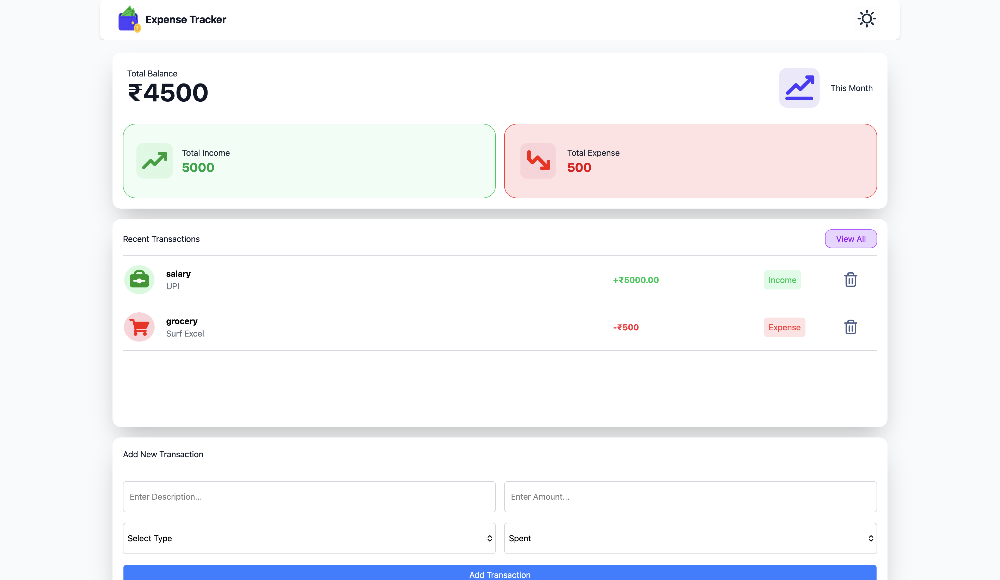
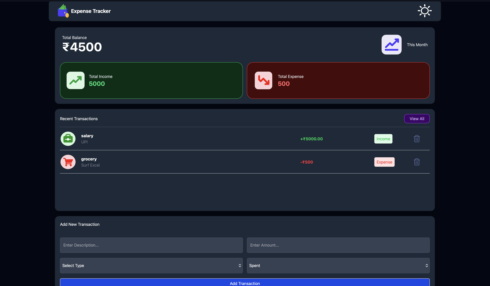

# Expense Tracker

> A modern, responsive expense tracking web application for managing income, expenses, and personal finances through a clean and intuitive dashboard.

[](https://developer.mozilla.org/en-US/docs/Web/HTML)
[](https://developer.mozilla.org/en-US/docs/Web/JavaScript)
[](https://tailwindcss.com/)

## 🚀 Live Demo

Experience the Expense Tracker application live:


<a href="https://expense-tracker-ayan-298e.vercel.app/" target="_blank">
  
</a>

---
## 📸 Screenshots

### ☀️ Light Mode



### 🌙 Dark Mode



---
## 📌 Overview

**Expense Tracker** is a frontend-focused personal finance application designed to make everyday income and expense tracking simple and intuitive.

The application provides a dashboard-style interface where users can monitor:

- Current balance
- Total income
- Total expenses
- Recent transactions
- Transaction categories

Users can add transactions by specifying a description, amount, category, and transaction type.

The project demonstrates practical frontend development concepts including **DOM manipulation, event-driven JavaScript, dynamic UI rendering, state management, responsive layouts, and Tailwind CSS**.

---

## ✨ Key Features

- 💰 **Balance Dashboard** — Displays the current available balance.
- 📈 **Income Tracking** — Calculates and displays total received income.
- 📉 **Expense Tracking** — Calculates and displays total spending.
- 📝 **Transaction Management** — Add transactions with description, amount, category, and type.
- 🧾 **Transaction Feed** — Dynamically renders newly added transactions.
- 🏷️ **Multiple Categories** — Supports Salary, Food, Transport, Game, Healthcare, and Grocery.
- 🛡️ **Insufficient Balance Protection** — Prevents spending when available balance is insufficient.
- 🌞 **Light Mode** — Clean and minimal light interface.
- 🌙 **Dark Mode** — Fully supported dark theme with theme switching.
- ⚡ **Dynamic UI Updates** — Dashboard values update instantly when transactions are added.
- 🎨 **Modern UI** — Responsive cards, rounded components, shadows, hover states, and smooth transitions.

---

## 🛠️ Tech Stack

| Technology | Purpose |
| --- | --- |
| **HTML5** | Application structure and semantic markup |
| **CSS3** | Styling and presentation |
| **JavaScript (ES6+)** | Application logic, DOM manipulation, and state updates |
| **Tailwind CSS 4** | Utility-first styling and responsive UI |
| **Node.js / npm** | Dependency management and frontend tooling |
| **Vercel** | Deployment and hosting |

---

## 🔄 Application Flow

```text
User enters transaction details
          ↓
Select category + transaction type
          ↓
Click "Add Transaction"
          ↓
JavaScript captures transaction data
          ↓
Balance / Income / Expense values are updated
          ↓
Transaction is dynamically rendered
          ↓
Dashboard reflects the updated financial state
```

---

## 📂 Project Structure

```text
Expense-Tracker/
│
├── screenshots/
│   ├── light-mode.png      # Light mode screenshot
│   └── dark-mode.png       # Dark mode screenshot
│
├── icons/                  # Category and UI icons
│
├── index.html              # Main application interface
├── index.js                # Application logic and DOM interactions
├── input.css               # Tailwind CSS source
├── output.css              # Compiled Tailwind CSS
├── package.json            # Project dependencies
├── package-lock.json       # Dependency lock file
└── README.md               # Project documentation
```

---

## ⚙️ Getting Started

### Prerequisites

Make sure you have the following installed:

- **Node.js**
- **npm**

### Installation

#### 1. Clone the repository

```bash
git clone https://github.com/AyanPrt43/Expense-Tracker.git
```

#### 2. Navigate to the project directory

```bash
cd Expense-Tracker
```

#### 3. Install dependencies

```bash
npm install
```

#### 4. Start Tailwind CSS

```bash
npx @tailwindcss/cli -i ./input.css -o ./output.css --watch
```

#### 5. Run the application

Open `index.html` in your browser.

---

## 💻 Usage

1. Enter a **transaction description**.
2. Enter the **transaction amount**.
3. Select a **category**.
4. Select whether the transaction was **Received** or **Spent**.
5. Click **Add Transaction**.
6. The dashboard automatically updates the balance and income/expense totals.
7. The transaction appears in the **Recent Transactions** section.
8. Use the theme toggle to switch between **Light Mode** and **Dark Mode**.

---


---

## 🧠 What This Project Demonstrates

This project demonstrates practical frontend development skills including:

- Building a complete responsive UI from scratch
- Creating a dashboard-based application interface
- DOM manipulation using JavaScript
- Handling user interactions and browser events
- Managing application state
- Dynamically generating HTML elements
- Implementing conditional logic
- Updating UI values dynamically
- Implementing light and dark themes
- Using Tailwind CSS 4
- Organizing frontend assets and project structure
- Deploying a frontend application using Vercel

---

## 🔮 Future Improvements

Potential improvements for future versions include:

- 💾 Persistent transaction storage using `localStorage`
- ✏️ Edit existing transactions
- 🗑️ Delete transactions
- 🔍 Search and filter transactions
- 📅 Date-based transaction tracking
- 📊 Expense analytics and charts
- 📈 Monthly spending reports
- 📤 Export financial data
- 📱 Further mobile optimization
- 🔐 User authentication
- ☁️ Cloud-based transaction storage

---

## 🌐 Deployment

The application is deployed using **Vercel**.

### Live Application

**[🔗 Open Expense Tracker](https://expense-tracker-pi-self.vercel.app/)**

---

## 👨‍💻 Author

### Ayan Pratap Sonker

**Computer Science & Engineering | Full-Stack Developer**

- GitHub: [@AyanPrt43](https://github.com/AyanPrt43)
- Live Demo: [Expense Tracker](https://expense-tracker-pi-self.vercel.app/)

---

## 📄 License

This project is available for **learning and portfolio purposes**.